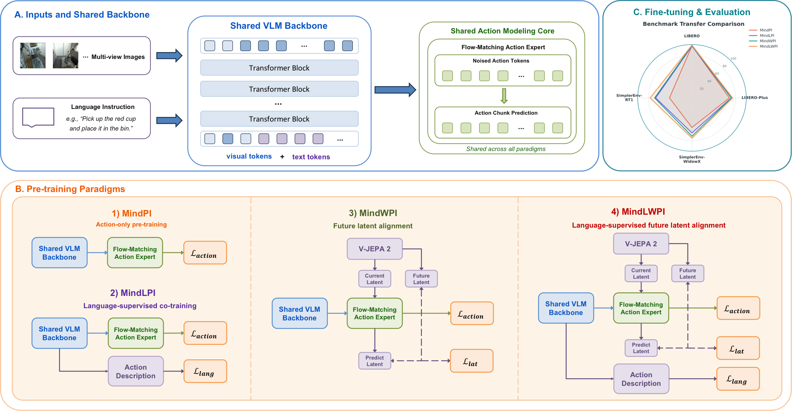
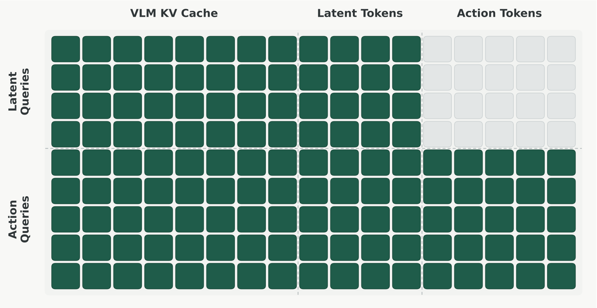
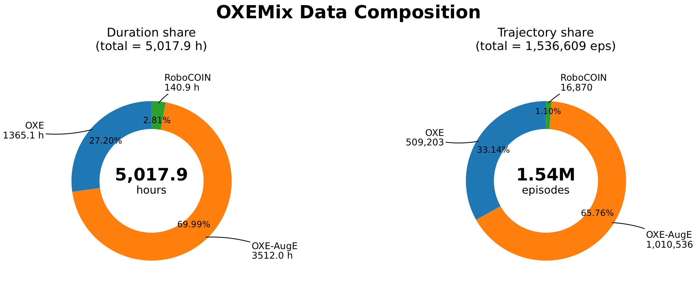
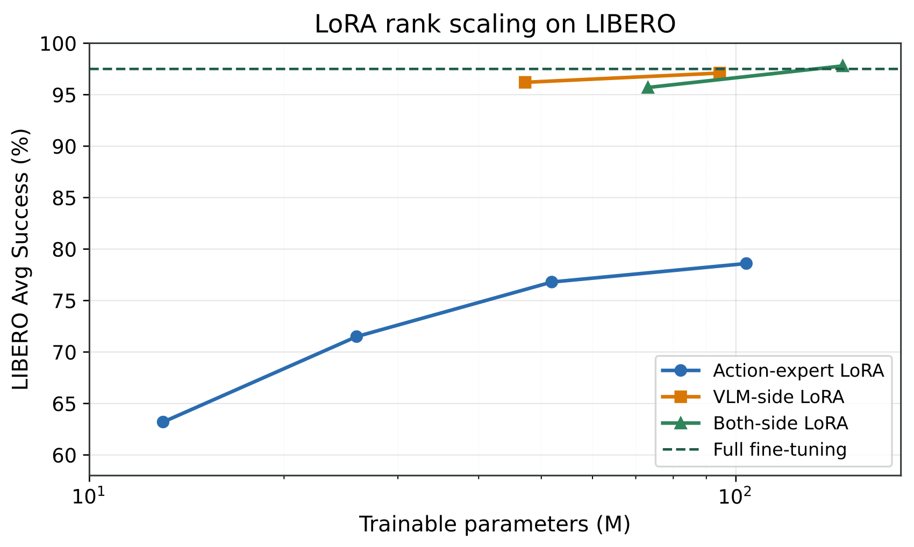
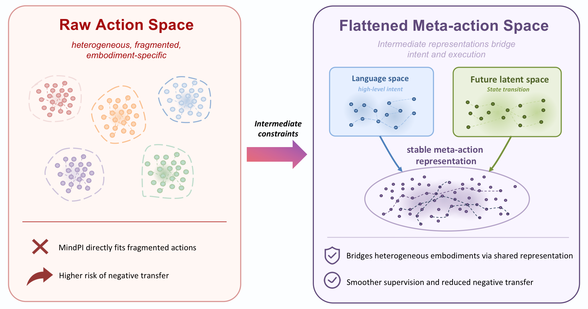

<div align="center">

# VLAFlow

### A Unified Training Framework for Vision-Language-Action Models via Co-training and Future Latent Alignment

Guoyang Xia<sup>1,2,*</sup>&nbsp;&nbsp; Fengfa Li<sup>1,*</sup>&nbsp;&nbsp; Hongjin Ji<sup>1,3</sup>&nbsp;&nbsp; Lei Ren<sup>1,†,‡</sup>&nbsp;&nbsp; Fangxiang Feng<sup>2,‡</sup>&nbsp;&nbsp; Kun Zhan<sup>1</sup>&nbsp;&nbsp; Yan Xie<sup>1</sup>

<sup>1</sup>Li Auto Inc.&nbsp;&nbsp; <sup>2</sup>School of Artificial Intelligence, Beijing University of Posts and Telecommunications&nbsp;&nbsp; <sup>3</sup>The Chinese University of Hong Kong, Shenzhen

<sup>*</sup>Equal contribution&nbsp;&nbsp; <sup>†</sup>Project leader&nbsp;&nbsp; <sup>‡</sup>Corresponding author

[](report/VLAFlow_Technical_Report.pdf)
[](https://mindvla-team.github.io/VLAFlow/)
[](https://github.com/MindVLA-Team/VLAFlow)

</div>

<p align="center">
  
</p>

---

## TL;DR

Different VLA pre-training paradigms are hard to compare because existing models differ in
architecture, data, action space, and evaluation. **VLAFlow** removes those confounders: it fixes
a single π₀-style flow-matching architecture, a shared VLM backbone, one action expert, a unified
14-D action space, and one evaluation protocol — so the **only variable is the training supervision
signal**. Under this controlled setup we compare four paradigms on ~5,000 hours of heterogeneous
robot data (**OXEMix**) and evaluate on LIBERO, LIBERO-Plus, and SimplerEnv.

> **Key result:** action-only pre-training is fragile on heterogeneous data and can *hurt* transfer.
> **Language supervision** (high-level intent) and **future-latent alignment** (state transition) are
> **complementary** intermediate constraints; combining them (**MindLWPI**) gives the most stable
> transfer across all three benchmarks.

VLAFlow is a **framework/benchmark, not a single model**. "Flow" refers both to the flow-matching
action mechanism and to how three supervision signals — low-level actions, language intent, and
future latent states — *flow* into the same action-generation backbone.

---

## Highlights

- **A controlled comparison of VLA training paradigms.** Four objectives compared under one
  architecture, action space, data mixture, and evaluation protocol — isolating the effect of the
  *training signal* itself.
- **Action-only pre-training can cause negative transfer.** Full-parameter action-only pre-training
  on heterogeneous data can perform *worse* than no pre-training; freezing the VLM preserves
  vision-language generalization but under-uses robot data.
- **Language ⟂ future-latent supervision are complementary.** Language injects "what to do"
  (intent); future-latent prediction injects "what the action changes" (state transition). Combined,
  they smooth heterogeneous action supervision.
- **A meta-action-space interpretation.** Language space and future visual latent space act as
  intermediate constraints that bridge heterogeneous embodiments into a smoother, more transferable
  action representation.

---

## The Four Paradigms

All paradigms share the same inputs, backbone, action expert, and downstream control form. They
differ **only** in whether language supervision, future-latent supervision, or both are added during
training. `PT` = pre-training, `FT` = downstream fine-tuning.

| Paradigm | Auxiliary supervision | PT loss | FT loss | Main role |
|---|---|---|---|---|
| **MindPI** | — | `L_act` | `L_act` | Action-only transfer baseline |
| **MindLPI** | language | `L_act + λ_lang·L_lang` | `L_act` | Injects high-level **action intent** via language |
| **MindWPI** | future latent | `L_act + λ_lat·L_lat` | `L_act + λ_lat·L_lat` | Regularizes with **future-state** prediction |
| **MindLWPI** | language + future latent | `L_act + λ_lat·L_lat + λ_lang·L_lang` | `L_act + λ_lat·L_lat` | Combines **intent + state-transition** constraints |

Recipe conventions from the report: `λ_lang = 0.1` (language loss used **in PT only**, dropped at FT
so control frequency is unaffected); MindWPI/MindLWPI use action:latent = **1:1** during PT and
**0.1:1** during FT; MindLPI uses **no stop-gradient** (the action loss backpropagates into the VLM —
ablations show stop-gradient hurts sharply).

---

## Framework at a Glance

- **Backbone:** Qwen3-VL-4B-Instruct (36 layers, hidden 2048, 16 heads / 8 KV heads, head-dim 128).
- **Action expert:** a DiT decoder (36 blocks, hidden 1280) predicting a flow-matching velocity field
  for an action chunk of length **T = 16**; timestep injected via AdaLN, RoPE on action tokens,
  **4 Euler steps** at inference.
- **Layer-wise KV-cache sharing:** the action expert does **not** re-encode images — at each layer it
  reuses the VLM's key/value cache, concatenated with its own K/V, so multimodal context flows in
  depth-aligned.
- **Unified 14-D action space:** two 7-DoF arms (EE translation + rotation increments + gripper);
  single-arm data is zero-padded with an action-validity mask.
- **Flow matching:** noised action `x_t = (1−t)·ε + t·a`, target velocity `a − ε`; loss masked to
  valid action dimensions.
- **Future latents (MindWPI / MindLWPI):** a **frozen V-JEPA 2** extracts current/future-frame
  latents (default future offset **8** frames); the action expert predicts the future latent while
  predicting actions. MindLWPI compresses 256 → 64 latent tokens with **AvgPool-k4**.

### Structured attention mask

To stop future-latent prediction from taking a shortcut through the action trajectory, latent tokens
may attend to the VLM cache and latent tokens but **not** to action tokens; action tokens may attend
to everything and thus use the predictive latent as visual context.

<p align="center">
  
</p>

---

## OXEMix Pre-training Corpus

A medium-scale, open-source robot-data mixture (~**5,018 hours**, ~**1.54M** episodes) converted to
LeRobot format and mapped into the unified 14-D action space. Sources: DROID, OpenX-Embodiment,
OpenX-Augmented, and RoboCOIN. Sampling balances dataset scale and trajectory length.

<p align="center">
  
</p>

| Source | Duration | Episodes |
|---|---:|---:|
| OpenX (raw, incl. DROID) | 1,365.1 h (27.2%) | 509,203 (33.1%) |
| OpenX-Augmented | 3,512.0 h (70.0%) | 1,010,536 (65.8%) |
| RoboCOIN | 140.9 h (2.8%) | 16,870 (1.1%) |
| **Total** | **5,017.9 h** | **1,536,609** |

---

## Results

Evaluated on **LIBERO** (near-saturated in-distribution sanity check), **LIBERO-Plus** (zero-shot
robustness under 7 perturbation types), and **SimplerEnv** (cross-embodiment transfer: WidowX/Bridge
+ RT-1 Visual Matching / Visual Augmentation). *Negative transfer* = a pre-trained model doing worse
than its no-pre-training baseline under the same FT protocol.

### Controlled comparison (main result)

Same architecture, action space, and evaluation protocol; the only difference is the training
objective. For SimplerEnv, WidowX uses Bridge-only FT and RT-1 uses RT-1-only FT; MindLWPI uses
AvgPool-k4 and downstream 0.1:1 ratio. **Bold** = best per column.

| Method | Robot PT | Aux. supervision | LIBERO Avg | LIBERO-Plus Total | WidowX Avg | RT-1 VM | RT-1 VA |
|---|:---:|---|:---:|:---:|:---:|:---:|:---:|
| MindPI w/o PT | ✗ | — | 97.0 | 59.9 | 59.6 | 75.7 | 60.4 |
| MindWPI w/o PT | ✗ | future latent | 97.4 | 66.1 | 71.9 | 75.2 | 51.6 |
| MindPI (Frozen VLM) | ✓ | — | 97.2 | **74.9** | 54.4 | 72.7 | 66.0 |
| MindPI (Full PT) | ✓ | — | 97.5 | 68.8 | 65.9 | 68.2 | 55.5 |
| MindLPI | ✓ | language | 97.2 | 72.3 | 65.6 | 74.6 | 59.2 |
| MindWPI | ✓ | future latent | 98.5 | 72.6 | 74.5 | **86.7** | **71.1** |
| **MindLWPI** | ✓ | language + future latent | **99.1** | 74.8 | **75.5** | 84.4 | 69.8 |

- **MindPI (Full PT)** improves WidowX over no-PT but **degrades on RT-1** → action-only pre-training
  is unstable under heterogeneous data.
- **MindWPI** gives the **strongest RT-1 transfer** → future-latent alignment is especially effective
  for action-outcome / state-transition modeling.
- **MindLWPI** is the **most stable overall** (best on LIBERO, LIBERO-Plus context, and WidowX; close
  to best on RT-1) → language and future-latent supervision are complementary.

### Against public baselines on SimplerEnv

Same evaluation protocol, so VLAFlow variants sit alongside public numbers (success rate, %).

| Method | Size | RT-1 VM | RT-1 VA | WidowX |
|---|:---:|:---:|:---:|:---:|
| π₀ | 3B | 58.8 | 56.8 | 27.8 |
| π₀ + FAST | 3B | 61.9 | 60.5 | 39.5 |
| OpenVLA-OFT | 7B | 63.0 | 54.3 | 31.3 |
| SpatialVLA | 4B | 75.1 | 70.7 | 42.7 |
| MemoryVLA | 7B | 77.7 | **72.7** | 71.9 |
| **MindWPI (ours)** | 4B | **86.7** | 71.1 | 74.5 |
| **MindLWPI (ours)** | 4B | 84.4 | 69.8 | **75.5** |

On LIBERO, MindLWPI reaches **99.1** average (99.2 / 99.8 / 99.2 / 98.2 on Spatial / Object / Goal /
Long), competitive with recent strong baselines while being compared under a unified protocol. Full
per-suite and per-perturbation tables are in the [technical report](report/VLAFlow_Technical_Report.pdf).

### Efficient adaptation (LoRA)

Injecting LoRA only into the **action expert** cannot match full fine-tuning; **VLM-side** LoRA
approaches full FT with ~100M trainable parameters, and **both-side** LoRA is best under a larger
budget — downstream adaptation needs low-rank capacity for the *vision-language* representation, not
only the action head.

<p align="center">
  
</p>

---

## Key Insight: a Meta-Action Space

Low-dimensional action labels alone struggle to form a stable representation across heterogeneous
embodiments, sampling rates, and action definitions. Language (high-level intent) and future latents
(state transition) provide complementary intermediate constraints that "flatten" the fragmented raw
action space into a smoother, more transferable **meta-action space**.

<p align="center">
  
</p>

---

## Report

The full technical report (method, appendices with KV-cache/attention-mask/latent details, complete
result tables, and hyperparameters) is included in this repository:

📄 [**report/VLAFlow_Technical_Report.pdf**](report/VLAFlow_Technical_Report.pdf)

---

## Citation

If you find VLAFlow useful, please cite:

```bibtex
@techreport{xia2026vlaflow,
  title       = {VLAFlow: A Unified Training Framework for Vision-Language-Action
                 Models via Co-training and Future Latent Alignment},
  author      = {Xia, Guoyang and Li, Fengfa and Ji, Hongjin and Ren, Lei and
                 Feng, Fangxiang and Zhan, Kun and Xie, Yan},
  institution = {Li Auto Inc.},
  year        = {2026},
  note        = {Technical Report}
}
```

---

## License

Released under the **[Apache License 2.0](LICENSE)** — Copyright 2026 Li Auto Inc.
See [`LICENSE`](LICENSE) and [`NOTICE`](NOTICE) for details.

---

<div align="center">
<sub>VLAFlow · Li Auto Inc. · Beijing University of Posts and Telecommunications · CUHK-Shenzhen</sub>
</div>
