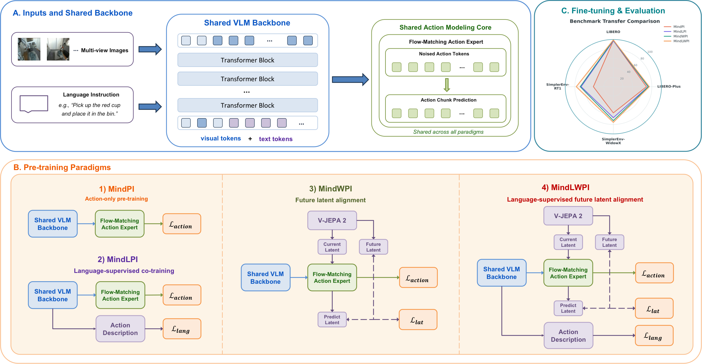
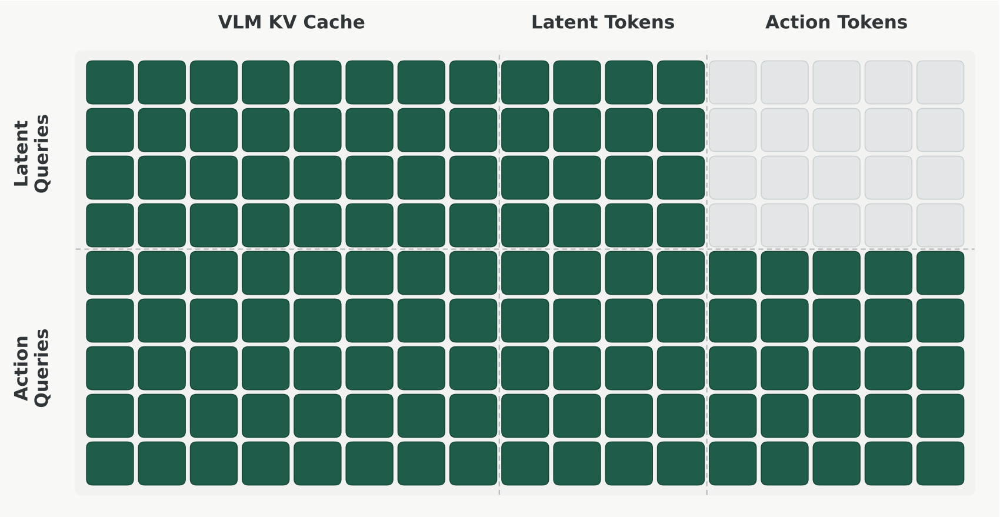

<div align="center">

# VLAFlow

### A Unified Training Framework for Vision-Language-Action Models via Co-training and Future Latent Alignment

Guoyang Xia<sup>1,2,*</sup>&nbsp;&nbsp; Fengfa Li<sup>1,*</sup>&nbsp;&nbsp; Hongjin Ji<sup>1,3</sup>&nbsp;&nbsp; Lei Ren<sup>1,†,‡</sup>&nbsp;&nbsp; Fangxiang Feng<sup>2,‡</sup>&nbsp;&nbsp; Kun Zhan<sup>1</sup>&nbsp;&nbsp; Yan Xie<sup>1</sup>

<sup>1</sup>Li Auto Inc.&nbsp;&nbsp; <sup>2</sup>School of Artificial Intelligence, Beijing University of Posts and Telecommunications&nbsp;&nbsp; <sup>3</sup>The Chinese University of Hong Kong, Shenzhen

<sup>*</sup>Equal contribution&nbsp;&nbsp; <sup>†</sup>Project leader&nbsp;&nbsp; <sup>‡</sup>Corresponding author

[](https://arxiv.org/abs/2607.01586)
[](report/VLAFlow_Technical_Report.pdf)
[](https://mindvla-team.github.io/VLAFlow/)
[](https://github.com/MindVLA-Team/VLAFlow)

</div>

<p align="center">
  
</p>

## TL;DR

**VLAFlow is a unified training framework, not a single model.** It compares action-only
learning, language co-training, future-latent alignment, and their combination under a shared
flow-matching architecture, VLM backbone, 14-D action space, data mixture, and evaluation protocol.
This controlled setup isolates the effect of the **training supervision signal**.

> **Key finding from the paper:** action-only pre-training on heterogeneous robot data can hurt
> downstream transfer. Language supervision captures high-level intent, while future-latent
> alignment captures state transitions. Combining them in **MindLWPI** supports more consistent
> transfer across LIBERO, LIBERO-Plus, and SimplerEnv.

## TODO

- [x] Release training code.
- [x] Release [pre-trained weights](#pre-trained-models) and downstream fine-tuned weights for [LIBERO](#libero-fine-tuned-models) and [SimplerEnv](#simplerenv-fine-tuned-models).
- [ ] Provide an SO-ARM real-world experiment demo.

## Pre-trained Models

The three **OXEMix-pre-trained base models** are now available on Hugging Face.
These are pre-training checkpoints for downstream fine-tuning, not benchmark-specific
fine-tuned policies. For benchmark evaluation, use the downstream fine-tuned models below.

| Model | Implementation | Released checkpoint | Hugging Face |
| --- | --- | --- | --- |
| **MindPI** | `MindPI` | `checkpoints/steps_200000_pytorch_model.pt` | [MindPI_OXEMix_BaseModel](https://huggingface.co/EmberNoWeither/MindPI_OXEMix_BaseModel) |
| **MindWPI** | `MindWPI` | `checkpoints/steps_200000_pytorch_model.pt` | [MindWPI_OXEMix_BaseModel](https://huggingface.co/EmberNoWeither/MindWPI_OXEMix_BaseModel) |
| **MindLWPI** | `MindLWPI_Compressed` (AvgPool-k4) | `checkpoints/steps_100000_pytorch_model.pt` | [MindLWPI_OXEMix_BaseModel](https://huggingface.co/EmberNoWeither/MindLWPI_OXEMix_BaseModel) |

Each model repository also includes `config.full.yaml`, `config.yaml`, and
`dataset_statistics.json`. Keep these files together with the `checkpoints/` directory.
Use the matching framework and see [Checkpoint migration](docs/checkpoints.md) for
configuration compatibility and local path updates. Download instructions are provided
[below](#download-a-pre-trained-model).

## LIBERO Fine-tuned Models

The three **OXEMix-pre-trained, LIBERO-fine-tuned policies** are now available on Hugging Face.
These checkpoints can also be evaluated on LIBERO-Plus without additional fine-tuning.

| Model | Implementation | Released checkpoint | Hugging Face |
| --- | --- | --- | --- |
| **MindPI** | `MindPI` | `checkpoints/steps_100000_pytorch_model.pt` | [MindPI_OXEMix_LIBERO_Finetuned](https://huggingface.co/EmberNoWeither/MindPI_OXEMix_LIBERO_Finetuned) |
| **MindWPI** | `MindWPI` | `checkpoints/steps_100000_pytorch_model.pt` | [MindWPI_LIBERO_Finetuned](https://huggingface.co/EmberNoWeither/MindWPI_LIBERO_Finetuned) |
| **MindLWPI** | `MindLWPI_Compressed` (AvgPool-k4) | `checkpoints/steps_100000_pytorch_model.pt` | [MindLWPI_LIBERO_Finetuned](https://huggingface.co/EmberNoWeither/MindLWPI_LIBERO_Finetuned) |

Download the complete repository, including its configuration and dataset statistics.
See [Download a fine-tuned model](#download-a-fine-tuned-model) and
[Evaluation](#evaluation) for download and policy-server examples.

## SimplerEnv Fine-tuned Models

The six **OXEMix-pre-trained policies fine-tuned on RT-1 or Bridge** are now available on
Hugging Face. Use the RT-1 checkpoints for RT-1 evaluation and the Bridge-fine-tuned
checkpoints for WidowX evaluation; their configurations and normalization statistics are
embodiment-specific.

| Model | Evaluation embodiment | Fine-tuning data | Released checkpoint | Hugging Face |
| --- | --- | --- | --- | --- |
| **MindPI** | RT-1 | RT-1 | `checkpoints/steps_50000_pytorch_model.pt` | [MindPI_OXEMix_SimplerEnv_RT1](https://huggingface.co/EmberNoWeither/MindPI_OXEMix_SimplerEnv_RT1) |
| **MindWPI** | RT-1 | RT-1 | `checkpoints/steps_50000_pytorch_model.pt` | [MindWPI_OXEMix_SimplerEnv_RT1](https://huggingface.co/EmberNoWeither/MindWPI_OXEMix_SimplerEnv_RT1) |
| **MindLWPI** | RT-1 | RT-1 | `checkpoints/steps_50000_pytorch_model.pt` | [MindLWPI_OXEMix_SimplerEnv_RT1](https://huggingface.co/EmberNoWeither/MindLWPI_OXEMix_SimplerEnv_RT1) |
| **MindPI** | WidowX | Bridge | `checkpoints/steps_50000_pytorch_model.pt` | [MindPI_OXEMix_SimplerEnv_WidowX](https://huggingface.co/EmberNoWeither/MindPI_OXEMix_SimplerEnv_WidowX) |
| **MindWPI** | WidowX | Bridge | `checkpoints/steps_60000_pytorch_model.pt` | [MindWPI_OXEMix_SimplerEnv_WidowX](https://huggingface.co/EmberNoWeither/MindWPI_OXEMix_SimplerEnv_WidowX) |
| **MindLWPI** | WidowX | Bridge | `checkpoints/steps_60000_pytorch_model.pt` | [MindLWPI_OXEMix_SimplerEnv_WidowX](https://huggingface.co/EmberNoWeither/MindLWPI_OXEMix_SimplerEnv_WidowX) |

The implementations are `MindPI`, `MindWPI`, and `MindLWPI_Compressed` (AvgPool-k4), respectively.
Keep each checkpoint with its own `config.full.yaml`, `config.yaml`, and
`dataset_statistics.json`. See [Download a fine-tuned model](#download-a-fine-tuned-model)
and the [SimplerEnv evaluation protocols](docs/evaluation.md).

## Highlights

- **Controlled comparisons:** the same backbone and action expert support different supervision
  objectives, alongside frozen-VLM and no-robot-pretraining controls.
- **Complementary supervision:** language describes what to do; future visual latents constrain
  how the scene should change.
- **Heterogeneous robot data:** OXEMix combines approximately 5,018 hours of robot trajectories
  in a unified action representation.
- **Training and evaluation recipes:** OXEMix pre-training, LIBERO and Bridge/RT-1 fine-tuning,
  and policy-server evaluation on LIBERO, LIBERO-Plus, and SimplerEnv.

## Training Paradigms

The paper studies four paradigms. **This code release contains three implementations**;
MindLPI and the broader ablation collection are not included.

| Paper name | Auxiliary supervision | Implementation in this release |
| --- | --- | --- |
| **MindPI** | None; action-only baseline | `MindPI` |
| **MindWPI** | Future latent | `MindWPI` |
| **MindLWPI** | Language + future latent | `MindLWPI_Compressed` (AvgPool-k4) |

Language supervision is used during MindLWPI pre-training and disabled during downstream
fine-tuning. Future-latent supervision remains active for MindWPI and MindLWPI. The released
recipes use **latent:action loss weights of 1:1 in pre-training and 0.1:1 in fine-tuning**;
the MindLWPI pre-training language weight is 0.1.

## Framework

- **VLM backbone:** Qwen3-VL-4B-Instruct.
- **Action expert:** a 36-layer, width-1280 DiT with layer-wise VLM KV-cache sharing.
- **Action representation:** 14 dimensions, 16-step action chunks, and validity masks for
  padded dimensions; single-arm evaluation uses the right-arm 7-D slice.
- **Flow matching:** four Euler steps at inference.
- **Future-latent targets:** a frozen V-JEPA 2 encoder, with a default future-frame offset of 8.
  MindLWPI uses AvgPool-k4 latent compression.
- **Structured attention:** latent tokens cannot attend to action tokens, while action tokens
  can use the predictive latent context.

<p align="center">
  
</p>

## OXEMix

The paper's pre-training mixture combines OpenX-Embodiment (including DROID), OpenX-Augmented,
and RoboCOIN, converted to LeRobot format and mapped into the shared action space.

| Source | Duration | Episodes |
| --- | ---: | ---: |
| OpenX (raw, including DROID) | 1,365.1 h | 509,203 |
| OpenX-Augmented | 3,512.0 h | 1,010,536 |
| RoboCOIN | 140.9 h | 16,870 |
| **Total** | **5,017.9 h** | **1,536,609** |

See [Data preparation](docs/data.md) for directory layouts, modality metadata, conversion,
and global normalization statistics. Datasets must be obtained separately under their own terms.

## Results Reported in the Paper

Success rates (%), transcribed from the technical report and project README. **These are paper
results, not a claim that this release candidate has re-run or reproduced every experiment.**
PT means robot pre-training; VM/VA denote Visual Matching/Visual Augmentation.

| Method | LIBERO Avg | LIBERO-Plus Total | WidowX Avg | RT-1 VM | RT-1 VA |
| --- | ---: | ---: | ---: | ---: | ---: |
| MindPI w/o PT | 97.0 | 59.9 | 59.6 | 75.7 | 60.4 |
| MindWPI w/o PT | 97.4 | 66.1 | 71.9 | 75.2 | 51.6 |
| MindPI (Frozen VLM) | 97.2 | **74.9** | 54.4 | 72.7 | 66.0 |
| MindPI (Full PT) | 97.5 | 68.8 | 65.9 | 68.2 | 55.5 |
| MindLPI (paper only) | 97.2 | 72.3 | 65.6 | 74.6 | 59.2 |
| MindWPI | 98.5 | 72.6 | 74.5 | **86.7** | **71.1** |
| **MindLWPI** | **99.1** | 74.8 | **75.5** | 84.4 | 69.8 |

WidowX uses Bridge-only fine-tuning; RT-1 uses RT-1-only fine-tuning. LIBERO-Plus evaluates
LIBERO-fine-tuned policies without additional training. Full protocols, ablations, and baseline
comparisons are in the [technical report](report/VLAFlow_Technical_Report.pdf).
The bundled report is **arXiv:2607.01586v2 (August 4, 2026)**, with 38 PDF pages.

## Installation

Use **Linux with NVIDIA GPUs**, Python 3.10, and a compatible CUDA/PyTorch environment for
training. The runtime dependencies pin PyTorch 2.6.0, torchvision 0.21.0, and Transformers 4.57.0.

```bash
git clone https://github.com/MindVLA-Team/VLAFlow.git
cd VLAFlow
python -m venv .venv
source .venv/bin/activate
python -m pip install --upgrade pip
python -m pip install -e '.[dev,eval]'

# Optional, after matching the CUDA toolkit and PyTorch:
python -m pip install flash-attn --no-build-isolation
```

The backbone falls back to PyTorch SDPA when FlashAttention is unavailable. Install each
benchmark simulator in its own environment; the policy server runs in the VLAFlow environment.
Data conversion may also require `ffmpeg`; see [Data preparation](docs/data.md).

### Backbones and Checkpoints

Download the backbones separately and arrange them under `MODEL_ROOT`:

```text
models/
  Qwen3-VL-4B-Instruct/
  vjepa2-vitl-fpc16-256/    # Required for MindWPI and MindLWPI
```

These are backbone weights, **not the VLAFlow OXEMix-pre-trained checkpoints** listed
[above](#pre-trained-models). The released VLAFlow checkpoints do not replace these backbone
directories; configure `MODEL_ROOT` for your local backbone files.

### Download a Pre-trained Model

After [installation](#installation), use the Hugging Face CLI to download a complete model
repository, preserving its configuration, statistics, and checkpoint layout. For MindWPI:

```bash
hf download EmberNoWeither/MindWPI_OXEMix_BaseModel \
  --local-dir models/MindWPI_OXEMix_BaseModel

# Use this weight file with the matching MindWPI fine-tuning recipe.
export PRETRAINED_CHECKPOINT="$PWD/models/MindWPI_OXEMix_BaseModel/checkpoints/steps_200000_pytorch_model.pt"
```

### Download a Fine-tuned Model

Download the complete repository for the target benchmark. For example:

```bash
# LIBERO / LIBERO-Plus: MindLWPI, 100000 steps.
hf download EmberNoWeither/MindLWPI_LIBERO_Finetuned \
  --local-dir models/MindLWPI_LIBERO_Finetuned
export PRETRAINED_CHECKPOINT="$PWD/models/MindLWPI_LIBERO_Finetuned/checkpoints/steps_100000_pytorch_model.pt"
```

```bash
# SimplerEnv WidowX (Bridge fine-tuning): MindLWPI, 60000 steps.
hf download EmberNoWeither/MindLWPI_OXEMix_SimplerEnv_WidowX \
  --local-dir models/MindLWPI_OXEMix_SimplerEnv_WidowX
export PRETRAINED_CHECKPOINT="$PWD/models/MindLWPI_OXEMix_SimplerEnv_WidowX/checkpoints/steps_60000_pytorch_model.pt"
```

For another model or RT-1 evaluation, substitute the repository and checkpoint filename
from the corresponding table. Keep the downloaded directory layout intact and configure
local backbone paths as described in [Checkpoint migration](docs/checkpoints.md).
Then follow the matching benchmark setup in [Evaluation](docs/evaluation.md).

## Quick Start

Prepare datasets using [Data preparation](docs/data.md), then set resource paths:

```bash
export DATA_ROOT=/path/to/data
export MODEL_ROOT=/path/to/models
export OUTPUT_ROOT=/path/to/outputs
export GPUS_PER_NODE=8
unset PRETRAINED_CHECKPOINT

# Inspect the effective configuration without loading models or starting training.
bash examples/OXE_Mix/train_files/run_mindwpi_oxemix_pretrain.sh --dry-run

# Pre-train MindWPI on all OXEMix sources.
bash examples/OXE_Mix/train_files/run_mindwpi_oxemix_pretrain.sh

# Fine-tune the resulting checkpoint on LIBERO.
export DATA_ROOT=/path/to/libero/data
export PRETRAINED_CHECKPOINT=/path/to/run/checkpoints/steps_200000_pytorch_model.pt
bash examples/LIBERO/train_files/run_mindwpi_libero_finetune.sh
```

The eight-GPU example is a launch example, not the paper's full compute configuration:
pre-training defaults give global batch 64 on one such node, versus the paper reference of 512.
Configure node count or gradient accumulation explicitly to match the intended experiment.
For MindLWPI pre-training, also compute `oxemix_global_norm_stats.json` from the actual data
mixture before launching. Full OXEMix recipes require all three data sources.

See [Training](docs/training.md) for all model recipes, distributed settings, resource overrides,
frozen-VLM/no-pretraining controls, and paper defaults.

## Evaluation

Evaluation uses a WebSocket policy server and a separate benchmark client. For a
**LIBERO-fine-tuned** checkpoint, start the server in the VLAFlow environment:

```bash
export PRETRAINED_CHECKPOINT=/path/to/run/checkpoints/steps_100000_pytorch_model.pt
export POLICY_PYTHON=/path/to/vlaflow/environment/bin/python
export POLICY_PORT=10093
bash examples/LIBERO/eval_files/run_policy_server.sh
```

In a second terminal, from the repository root, run the client using your installed LIBERO
environment:

```bash
export PRETRAINED_CHECKPOINT=/path/to/run/checkpoints/steps_100000_pytorch_model.pt
export SIM_PYTHON=/path/to/libero/environment/bin/python
export LIBERO_HOME=/path/to/LIBERO
export POLICY_HOST=127.0.0.1
export POLICY_PORT=10093
export OUTPUT_ROOT=/path/to/evaluation
bash examples/LIBERO/eval_files/run_eval.sh
```

Keep run configuration and dataset statistics alongside the weights. The checkpoint must be
accessible to the client as well as the server. See [Evaluation](docs/evaluation.md) for
LIBERO-Plus, SimplerEnv Bridge/RT-1 protocols, simulator setup, and metric summaries;
[Checkpoints](docs/checkpoints.md) describes checkpoint metadata and migration.

## Repository Layout

| Path | Contents |
| --- | --- |
| [`vlaflow/`](vlaflow/) | Models, data pipelines, trainers, and portable launcher |
| [`examples/`](examples/) | Dataset registries, training recipes, and benchmark clients |
| [`deployment/`](deployment/) | WebSocket policy server and client utilities |
| [`scripts/`](scripts/) | Data conversion, metadata, normalization, and metric summaries |
| [`docs/`](docs/) | Data, training, evaluation, checkpoints, and release guidance |
| [`index.html`](index.html), [`assets/`](assets/), [`report/`](report/) | Existing project website, figures, and technical report |

## Acknowledgments

We thank [starVLA](https://github.com/starVLA/starVLA),
[LDA-1B](https://github.com/jiangranlv/LDA-1B), and
[Abot-M0](https://github.com/amap-cvlab/ABot-Manipulation) for their open-source contributions.

VLAFlow builds on StarVLA and includes code attributed to NVIDIA, OpenVLA, SimplerEnv,
robosuite, and msgpack-numpy. We also thank the Qwen, V-JEPA 2, LeRobot, dataset, and benchmark
communities. See [Third-party notices](THIRD_PARTY_NOTICES.md) for component-level attribution.

## Citation

```bibtex
@article{xia2026vlaflow,
  title   = {VLAFlow: A Unified Training Framework for Vision-Language-Action
             Models via Co-training and Future Latent Alignment},
  author  = {Xia, Guoyang and Li, Fengfa and Ji, Hongjin and Ren, Lei and
             Feng, Fangxiang and Zhan, Kun and Xie, Yan},
  journal = {arXiv preprint arXiv:2607.01586},
  year    = {2026}
}
```

Machine-readable citation metadata is available in [`CITATION.cff`](CITATION.cff).

## License

VLAFlow's original code and Li Auto's modifications are released under the
**[Apache License 2.0](LICENSE)**. Copyright 2026 Li Auto Inc.

Third-party components retain their respective terms in source headers and [`LICENSES/`](LICENSES/),
including the [StarVLA license and additional upstream wording](LICENSES/LicenseRef-StarVLA.txt).
The package's license expression includes these third-party terms alongside Apache-2.0;
it does not replace or remove their attribution and redistribution requirements.
The existing project website and figures retain their
[Apache-2.0 license](LICENSES/Project-materials-Apache-2.0.txt) and
[original notice](LICENSES/Project-materials-NOTICE.txt).
The updated technical report is included as supplied by the authors, without modification;
its embedded arXiv license metadata is preserved. This repository does not assign a new
license to that PDF. See [Third-party notices](THIRD_PARTY_NOTICES.md) for details.

No license to separately downloaded model weights or datasets is granted by this repository.
